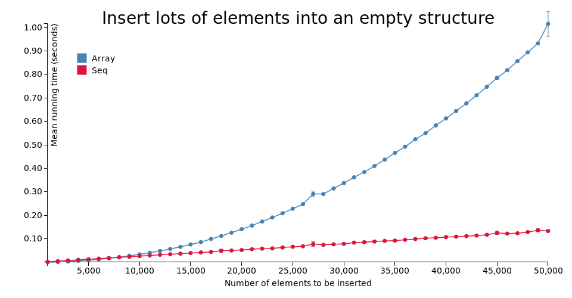
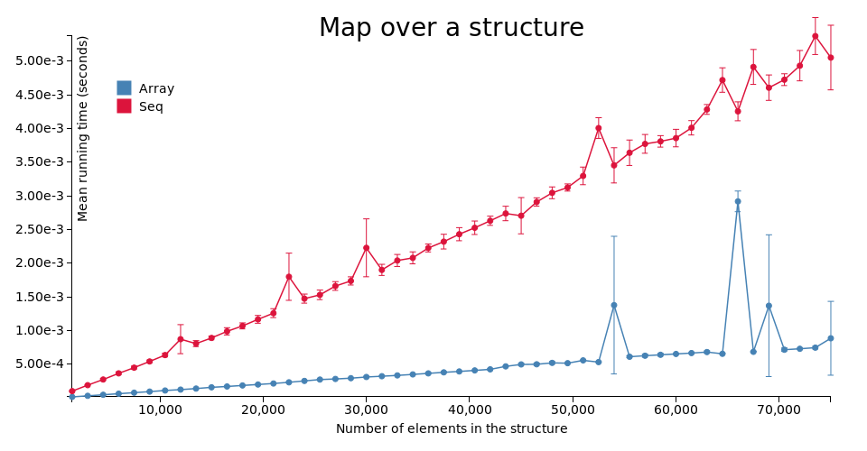
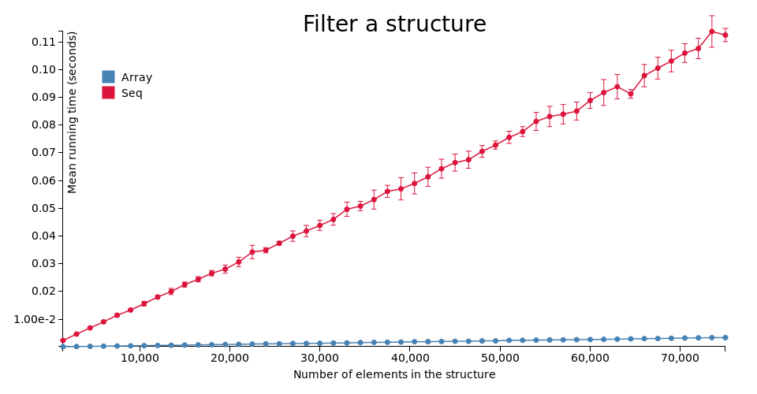
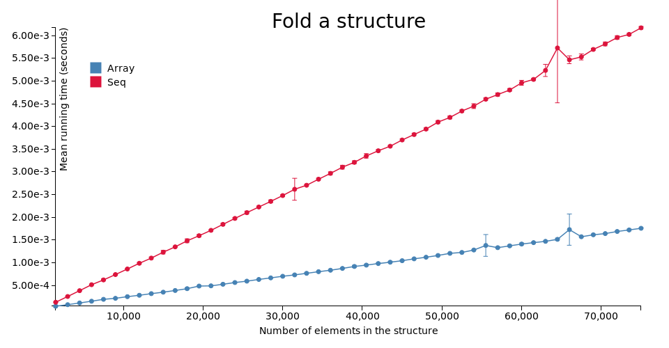
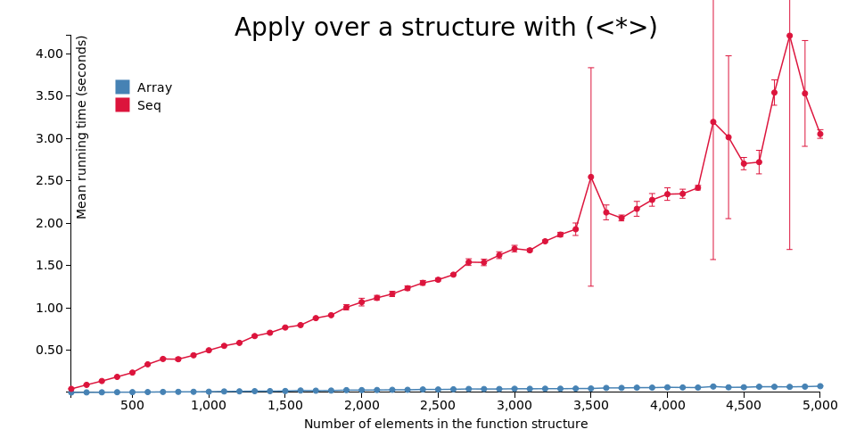
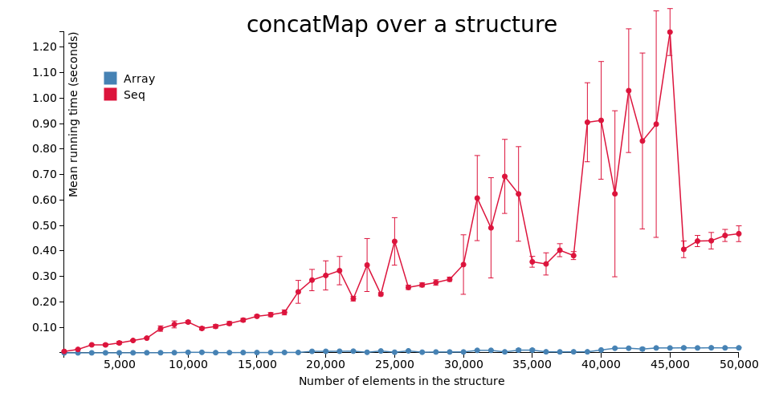
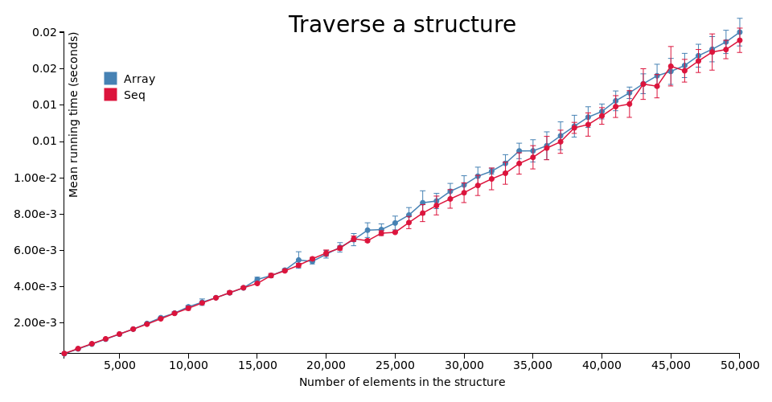

# purescript-sequences

Various efficient-ish sequence types for PureScript.

The implementations are based on 2-3 finger trees, as described in the paper
[_Finger Trees: A Simple General-Purpose Data Structure_][1], Ralf Hinze and
Ross Paterson, Journal of Functional Programming 16:2 (2006) pp 197-217.

Big props also go to [taku0](https://github.com/taku0) who did most of the
initial work on this.

## Documentation

You probably want one of:

* [Data.Sequence][]
* [Data.Sequence.NonEmpty][]
* [Data.Sequence.Ordered][]

This package also provides [Data.FingerTree][], which is what these are based
on, and may be useful for implementing other data structures.

## Why not just use Arrays all the time?

JavaScript's Array type is designed for use in an imperative programming
environment, where anything can be mutated at any time. This means that reusing
them is usually not possible. For example:

```javascript
var as = [1,2,3]
var bs = as.concat([4,5,6])
bs[0] = 10
```

`as[0]` should still be 1 after executing these statements. Therefore, `concat`
has to copy the whole array, and is therefore O(this.length + n), where n is
the length of the argument.

However in PureScript, values are immutable (ignoring the FFI). So we may take
advantage of this by writing functions that reuse parts of data structures
where possible. Sequences are one such structure - in this case, the amortized
complexity of `concat` is reduced to O(log(min(n1, n2))), where n1 and n2 are
the lengths of the arguments.

Amortized complexities of other operations:

|               | Native array | Sequence            |
|---------------|--------------|---------------------|
| cons/uncons   | O(n)         | O(1)                |
| getAt i       | O(1)         | O(log(min(i, n-i))) |
| setAt i       | O(n)         | O(log(min(i, n-i))) |
| splitAt i     | O(n)         | O(log(min(i, n-i))) |

## Is it faster?

Not always. For example:











## When is this approach _not_ suitable?

If you are using JavaScript libraries via the FFI, and passing Arrays back and
forth between PureScript and JavaScript, you might find that it's easier and
more efficient to just use Arrays. Generally, JavaScript libraries will not be
able to use the Seq type in this library, and so you would have to convert
between Seqs and Arrays at the PS/JS boundaries. The conversion in either
direction is O(n).

[1]: http://staff.city.ac.uk/~ross/papers/FingerTree.pdf
[Data.Sequence]: docs/Data/Sequence.md
[Data.Sequence.NonEmpty]: docs/Data/Sequence/NonEmpty.md
[Data.Sequence.Ordered]: docs/Data/Sequence/Ordered.md
[Data.FingerTree]: docs/Data/FingerTree.md
